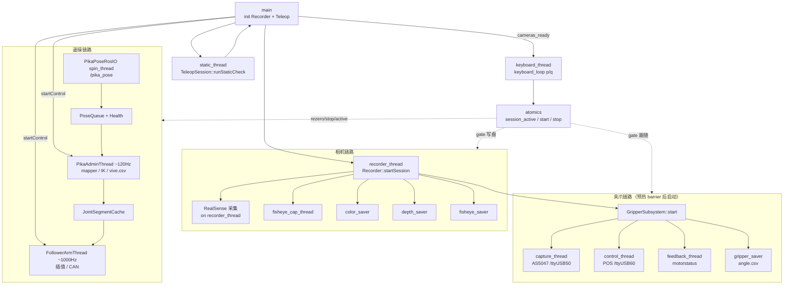
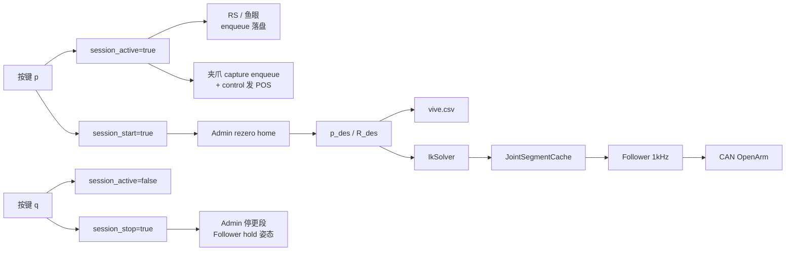

# utils/all_telop - 相机采集 + 串口夹爪 + OpenArm 遥操（统一 p/q）

合并 `utils/all`（RealSense/鱼眼/夹爪）与 `utils/sensor`（Pika 到 OpenArm 遥操）为**单一进程** `all_telop`。

**运行步骤（绑定 / CAN / 校准 / 启停 / 排查）见 [SOP.md](SOP.md)。**  
设备绑定细节见 [`scripts/DEVICE_BINDING_REPORT.md`](../../scripts/DEVICE_BINDING_REPORT.md)。

## 按键

- `p`：相机开始/继续写盘、夹爪跟随、机械臂遥操并 rezero（仅相机预热完成后有效）
- `q`：暂停相机写盘与夹爪跟随，机械臂保持姿态；同 episode 可再按 `p` 续录
- `Ctrl+C`：退出，落盘，disable 夹爪与电机

## 启动流程

1. 相机预热 barrier 与 Vive 静态校验并行
2. 相机全部就绪后进入 Ready（静态失败仍打印 `survive-cli` 提示，仍可按 `p`）
3. Ready 后等待 `p`，三端同步开启

## 线程流图

单一进程 `all_telop`。中心原子量 `session_active` / `session_start` / `session_stop` 由键盘线程写入，相机写盘、夹爪跟随、机械臂遥操共用。

### 总览



### Ready 后稳态数据流



### 线程一览

| 线程 | 何时启动 | 作用 |
| --- | --- | --- |
| `main` | 进程入口 | 编排初始化、等 barrier、join/退出 |
| `recorder_thread` | 与静态校验并行 | RealSense 预热/采集；拉起相机与夹爪子线程 |
| `static_thread` | 同上（短生命周期） | Vive 静态健康检查，结束后 join |
| `fisheye_cap_thread` | `startSession` | 鱼眼预热 + 采集 enqueue |
| `color/depth/fisheye_saver` | `startSession` | 从队列写图像文件与 CSV |
| `capture/control/feedback` | 两侧预热 barrier 后 | AS5047 读、夹爪控制、电机反馈 |
| `gripper_saver` | 夹爪 start 后 | 写 `gripper/angle.csv` |
| `PikaPoseRosIO spin_thread` | `teleop.init` | ROS MultiThreadedExecutor 收 `/pika_pose` |
| `PikaAdminThread` | Ready 后 `startControl` | ~120Hz：map → IK → 段缓存 → 写 vive.csv |
| `FollowerArmThread` | Ready 后 `startControl` | ~1000Hz：关节插值 → CAN；未 active 则 hold |
| `keyboard_thread` | Ready 后 | 读 stdin `p`/`q`，写会话原子量 |

门控约定：相机/夹爪看 `session_active`；Admin 看 `session_start`（rezero）与 `session_stop`（停遥操并 hold）。夹爪串口在 barrier 后即 open/enable，但 CSV 与 POS 跟随仍需 `p`。

## 数据目录

```
~/pika_ros/data/{episode}/
  color/
  depth/
  fisheye/
  csv/color.csv
  csv/depth.csv
  csv/fisheye.csv
  gripper/angle.csv
  sensor/vive.csv
```

`vive.csv` 语义与 `utils/sensor` 一致：期望 TCP（基座系）相对首次锁定 T0 的相对轨迹；`q`/`p` 不重置 T0。

## 依赖

- ROS2 Humble（`rclcpp`、`geometry_msgs`）、librealsense2、OpenCV、yaml-cpp、Boost.System、Eigen、orocos_kdl、kdl_parser、urdfdom
- OpenArm CAN 夹爪跳过：`Runtime.skip_gripper: true`（或 `OPENARM_SKIP_GRIPPER=1`）；夹爪跟随走串口 Pika
- USB / CAN / 启动命令见 [SOP.md](SOP.md)

## 配置

`config/default.yaml` 合并：

- `general` / `realsense` / `fisheye` / `saver` / `gripper` — 来自 all
- `Runtime` / `PikaCartesian` / `CartesianController` / `FollowerArmParam` — 来自 sensor

`general.duration_seconds: 0` 表示帧数无上限（由 p/q 与 Ctrl+C 控制）；`>0` 时为软上限 `duration*fps`。

原 `utils/all` 与 `utils/sensor` 目录保留，可继续独立使用。
