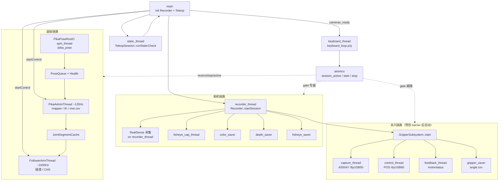
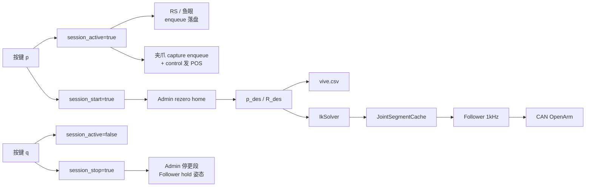

# utils/all_telop - 相机采集 + 串口夹爪 + OpenArm 遥操（统一 p/q）

合并 `utils/all`（RealSense/鱼眼/夹爪）与 `utils/sensor`（Pika 到 OpenArm 遥操）为**单一进程** `all_telop`。

## 按键

- `p`：相机开始/继续写盘、夹爪跟随、机械臂遥操并 rezero（仅相机预热完成后有效）
- `q`：暂停相机写盘与夹爪跟随，机械臂保持姿态；同 episode 可再按 `p` 续录
- `Ctrl+C`：退出，落盘，disable 夹爪与电机

## 启动流程

1. 相机预热 barrier 与 Vive 静态校验并行
2. 相机全部就绪后进入 Ready（静态失败仍打印 `survive-cli` 提示，仍可按 `p`）
3. Ready 后等待 `p`，三端同步开启

## 线程流图

单一进程 `all_telop`。中心原子量 `session_active` / `session_start` / `session_stop` 由键盘线程写入，相机写盘、夹爪跟随、机械臂遥操共用。

### 总览



### Ready 后稳态数据流



### 线程一览

| 线程 | 何时启动 | 作用 |
| --- | --- | --- |
| `main` | 进程入口 | 编排初始化、等 barrier、join/退出 |
| `recorder_thread` | 与静态校验并行 | RealSense 预热/采集；拉起相机与夹爪子线程 |
| `static_thread` | 同上（短生命周期） | Vive 静态健康检查，结束后 join |
| `fisheye_cap_thread` | `startSession` | 鱼眼预热 + 采集 enqueue |
| `color/depth/fisheye_saver` | `startSession` | 从队列写图像文件与 CSV |
| `capture/control/feedback` | 两侧预热 barrier 后 | AS5047 读、夹爪控制、电机反馈 |
| `gripper_saver` | 夹爪 start 后 | 写 `gripper/angle.csv` |
| `PikaPoseRosIO spin_thread` | `teleop.init` | ROS MultiThreadedExecutor 收 `/pika_pose` |
| `PikaAdminThread` | Ready 后 `startControl` | ~120Hz：map → IK → 段缓存 → 写 vive.csv |
| `FollowerArmThread` | Ready 后 `startControl` | ~1000Hz：关节插值 → CAN；未 active 则 hold |
| `keyboard_thread` | Ready 后 | 读 stdin `p`/`q`，写会话原子量 |

门控约定：相机/夹爪看 `session_active`；Admin 看 `session_start`（rezero）与 `session_stop`（停遥操并 hold）。夹爪串口在 barrier 后即 open/enable，但 CSV 与 POS 跟随仍需 `p`。

## 数据目录

输出路径：

```
~/pika_ros/data/{episode}/
  color/
  depth/
  fisheye/
  csv/color.csv
  csv/depth.csv
  csv/fisheye.csv
  gripper/angle.csv
  sensor/vive.csv
```

`vive.csv` 语义与 `utils/sensor` 一致：记录期望 TCP（机械臂基座系）相对首次锁定 T0 的相对轨迹；`q`/`p` 不重置 T0。

## 依赖 / 前置

- ROS2 Humble（`rclcpp`、`geometry_msgs`）、librealsense2、OpenCV、yaml-cpp、Boost.System、Eigen、orocos_kdl、kdl_parser、urdfdom
- CAN-FD `can0` 已 `up`（与原 sensor 相同）
- USB 角色必须为：
  - `/dev/ttyUSB50 -> ttyUSB1`（sensor：读取 AS5047）
  - `/dev/ttyUSB60 -> ttyUSB0`（gripper：控制 + motorstatus）
- 两个链接必须指向不同设备。sensor 口应包含 `AS5047.rad`，gripper 口应包含 `motor` / `motorstatus`

## 基站校准

静态检测不通过、或定位抖动过大时，先单独做基站校准（需占用 tracker，请先停掉 locator 节点）：

```
cd ~/pika_ros/install/pika_locator/lib
./survive-cli
```

强制重新校准：

```
cd ~/pika_ros/install/pika_locator/lib
./survive-cli --force-calibrate
```

校准完成后退出 `survive-cli`，再启动 locator 节点。

## 开启定位节点

终端 1 先启动 `pika_locator`（发布 `/pika_pose`）：

```
source /opt/ros/humble/setup.bash
source ~/pika_ros/install/setup.bash
ros2 launch pika_locator pika_single_locator_only.launch.py
```

## 编译与运行

```
source /opt/ros/humble/setup.bash
cd ~/pika_ros/utils/all_telop
chmod +x build.sh && ./build.sh
```

终端 2 运行 `all_telop`（locator 需已在运行）：

```
source /opt/ros/humble/setup.bash
source ~/pika_ros/install/setup.bash
cd ~/pika_ros/utils/all_telop/build
./all_telop [episode]
# 或 ./all_telop --config ../config/default.yaml
```

## 配置

`config/default.yaml` 合并：

- `general` / `realsense` / `fisheye` / `saver` / `gripper` — 来自 all
- `Runtime` / `PikaCartesian` / `CartesianController` / `FollowerArmParam` — 来自 sensor

`general.duration_seconds: 0` 表示帧数无上限（由 p/q 与 Ctrl+C 控制）；`>0` 时为软上限 `duration*fps`。

## 故障排查

- `angle.csv` 只有表头：先确认 `ttyUSB50` 读到的是 `AS5047.rad`，并确认已按 `p`
- 有角度但夹爪不使能、LED 不亮，回执持续为 `Status=0x21`：完全退出占用串口的程序，关闭 gripper 控制器电源并拔掉其 USB，等待约 5 秒后重新上电、插入，再运行
- 可用独立工具隔离相机和遥操：

```
cd ~/pika_ros/utils/gripper/build
./read_gripper_angle /dev/ttyUSB50 /dev/ttyUSB60 \
  --effort 1000 --velocity 20 --rate 100 --mit --verbose
```

- 若独立工具也持续显示 `Status=0x21 DIS`，问题位于 gripper 控制器状态、供电或串口发送链路，而不是 all_telop 的 `p`/`q` 门控
- RealSense 序列号 `230322274428` 未枚举时，相机 barrier 会中止，夹爪子系统也不会启动

原 `utils/all` 与 `utils/sensor` 目录保留，可继续独立使用。
